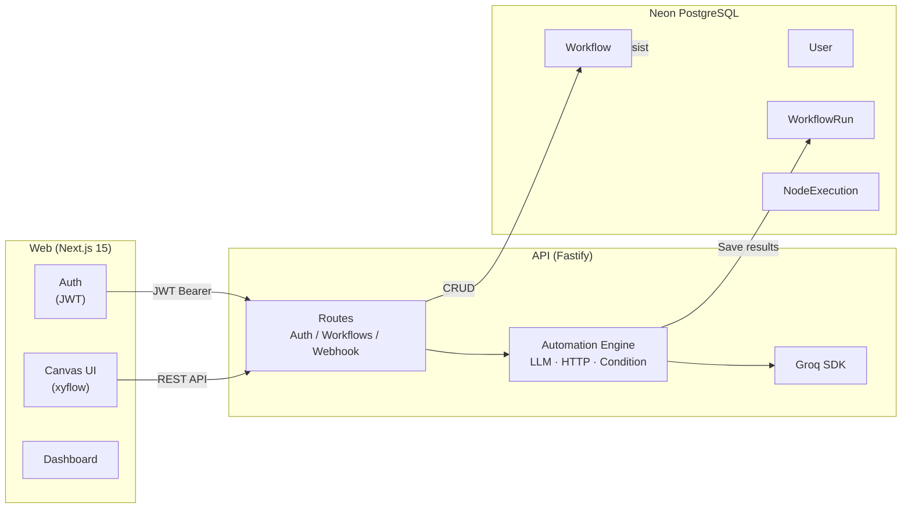
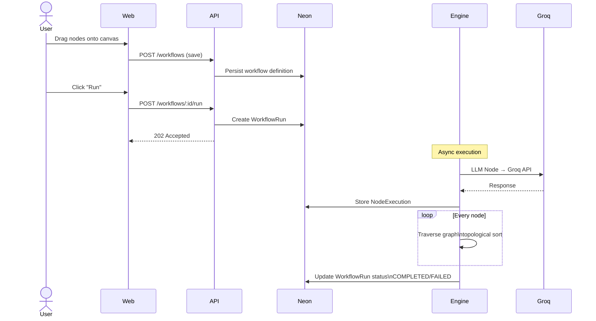
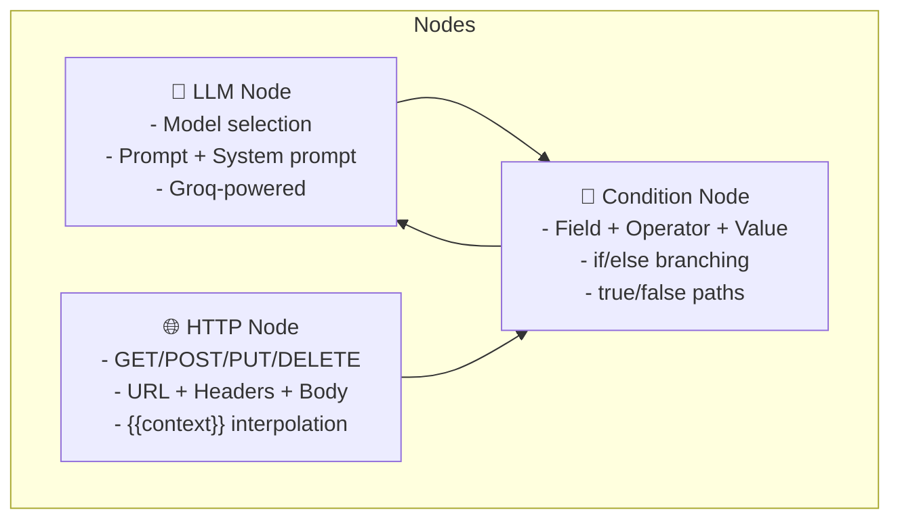
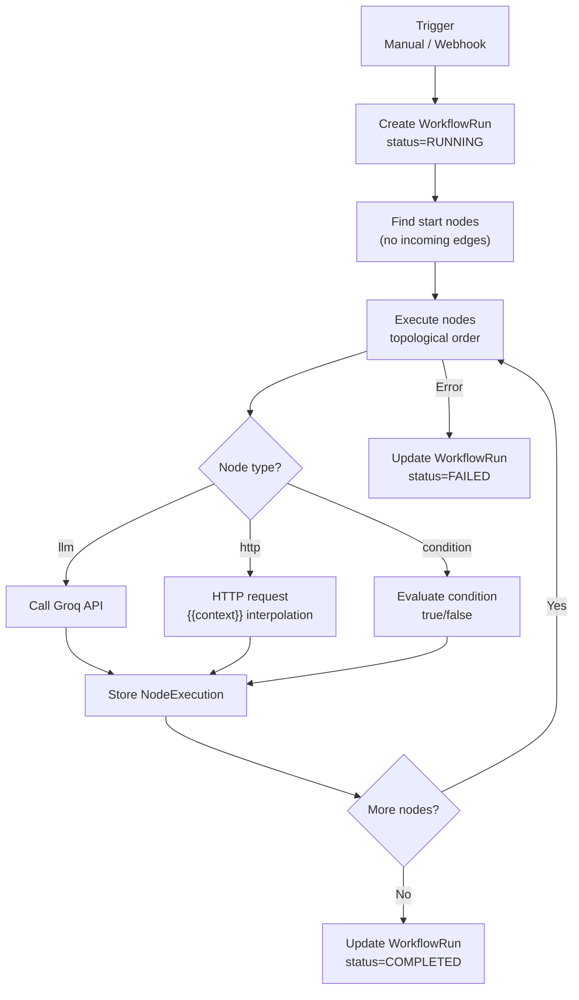

# Flowforge — Visual AI Workflow Builder

> Build AI automations with a drag-and-drop canvas. Powered by Groq LPU inference.

---

## Architecture



## How It Works



## Node Types



## Tech Stack

| Layer | Technology |
|-------|-----------|
| Frontend | Next.js 15 · xyflow · TailwindCSS |
| Backend | Fastify · TypeScript |
| Database | Neon PostgreSQL (Prisma) |
| AI Inference | Groq SDK |
| Auth | JWT (email/password) |

## Getting Started

```bash
# Clone the repo
git clone https://github.com/YOUR_USERNAME/flowforge.git
cd flowforge

# API setup
cd api
npm install
npx prisma generate
npx prisma db push
cp .env.example .env  # fill in credentials
npm run dev           # starts on :3001

# Web setup (new terminal)
cd ../web
npm install
npm run dev           # starts on :3000
```

## Environment Variables

```bash
# api/.env
DATABASE_URL="postgresql://..."
GROQ_API_KEY="gsk_..."
JWT_SECRET="your-32-char-secret"
PORT=3001
CORS_ORIGIN="http://localhost:3000"
```

## API Endpoints

| Method | Path | Description |
|--------|------|-------------|
| POST | `/auth/signup` | Create account |
| POST | `/auth/login` | Get JWT token |
| GET | `/workflows` | List user's workflows |
| POST | `/workflows` | Create workflow |
| GET | `/workflows/:id` | Get workflow |
| PUT | `/workflows/:id` | Update workflow |
| DELETE | `/workflows/:id` | Delete workflow |
| POST | `/workflows/:id/run` | Trigger manual run |
| GET | `/workflows/:id/runs` | List workflow runs |
| POST | `/webhook/:workflowPath` | Trigger via webhook |

## Workflow Execution Flow



## Roadmap

- [ ] Inngest integration for durable async execution
- [ ] Schedule trigger (cron-based)
- [ ] Stripe per-seat billing
- [ ] Team management
- [ ] Slack/Email integrations